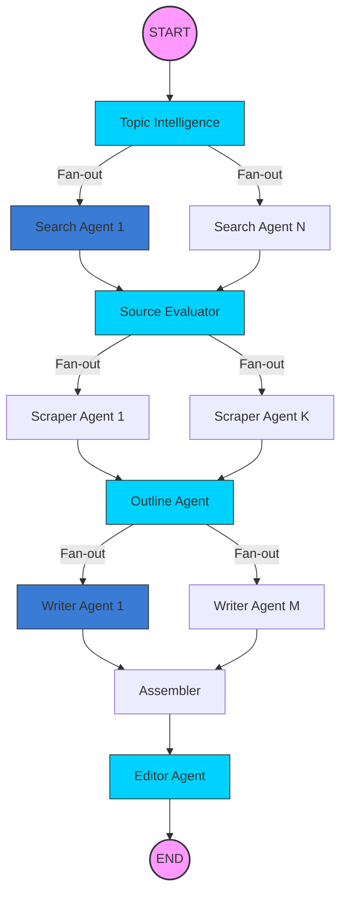

# ✍️ AI Blog Research & Writing Pipeline

A sophisticated multi-agent system powered by **LangGraph** that automates the entire lifecycle of blog post creation—from initial topic intelligence and deep web research to parallel content drafting and final SEO-optimized editorial review.

## 🏗️ Core Agentic Architecture

The project leverages a **Stateful, Parallel Graph Architecture** using LangGraph. Unlike linear chains, this pipeline utilizes "fan-out" and "fan-in" patterns to perform research and writing tasks in parallel, significantly reducing total generation time while maintaining high quality.

### High-Level Workflow Diagram



---
                               ┌─────────────┐
                               │    START    │
                               └──────┬──────┘
                                      │
                                      ▼
                          ┌──────────────────────┐
                          │  Topic Intelligence  │
                          └─────────┬────────────┘
                                    │
                    ┌───────────────┴───────────────┐
                    ▼                               ▼
         ┌──────────────────┐            ┌──────────────────┐
         │  Search Agent 1  │    ...     │  Search Agent N  │
         └─────────┬────────┘            └─────────┬────────┘
                   │                               │
                   └───────────────┬───────────────┘
                                   ▼
                        ┌──────────────────────┐
                        │   Source Evaluator   │
                        └─────────┬────────────┘
                                  │
               ┌──────────────────┴──────────────────┐
               ▼                                     ▼
     ┌──────────────────┐                  ┌──────────────────┐
     │ Scraper Agent 1  │        ...       │ Scraper Agent K  │
     └─────────┬────────┘                  └─────────┬────────┘
               │                                       │
               └──────────────────┬────────────────────┘
                                  ▼
                        ┌──────────────────────┐
                        │     Outline Agent    │
                        └─────────┬────────────┘
                                  │
               ┌──────────────────┴──────────────────┐
               ▼                                     ▼
     ┌──────────────────┐                  ┌──────────────────┐
     │  Writer Agent 1  │        ...       │  Writer Agent M  │
     └─────────┬────────┘                  └─────────┬────────┘
               │                                       │
               └──────────────────┬────────────────────┘
                                  ▼
                        ┌──────────────────────┐
                        │      Assembler       │
                        └─────────┬────────────┘
                                  ▼
                        ┌──────────────────────┐
                        │     Editor Agent     │
                        └─────────┬────────────┘
                                  ▼
                               ┌─────────────┐
                               │     END     │
                               └─────────────┘
## 🤖 Agent Roles & Responsibilities

| Agent | Responsibility | Output |
| :--- | :--- | :--- |
| **Topic Intelligence** | Analyzes the raw topic to create an SEO strategy and research blueprint. | Search queries, Keywords, Content Angle. |
| **Search Agent** | Executes parallel web searches using Tavily to find high-quality candidate URLs. | Raw URLs. |
| **Source Evaluator** | Critically evaluates URLs for authority, freshness, and relevance. | Ranked Scored Sources. |
| **Scraper Agent** | Extracts cleaned Markdown content from the top-ranked sources via Firecrawl. | Scraped Research Material. |
| **Outline Agent** | Synthesizes research into a detailed, hierarchical blog structure (H2s & H3s). | Structured Blog Outline. |
| **Writer Agent** | Drafts individual blog sections in parallel based on the outline and specific research. | Markdown Section Drafts. |
| **Assembler** | Integrates all parallel sections, writes Intro/Conclusion, and saves the full draft. | Unified Markdown Draft. |
| **Editor Agent** | Performs a final SEO audit and stylistic polish for coherence and flow. | Final Polished Post & Report. |

---

## 🔌 API Integrations

The pipeline utilizes several best-in-class APIs to deliver high-quality automated content:

1.  **OpenAI (GPT-4o)**: Powers the "brain" of every agent, handling structured reasoning, synthesis, and creative writing.
2.  **Tavily Search**: Optimized for AI agents, providing clean, search-engine-ready results without the noise of traditional search.
3.  **Firecrawl**: Handles the heavy lifting of web scraping, converting complex HTML into clean, LLM-ready Markdown while bypassing bot detections.

---

## 🚀 Getting Started

### 1. Environment Setup
Create a `.env` file in the root directory with the following keys:
```env
OPENAI_API_KEY=your_key
TAVILY_API_KEY=your_key
FIRECRAWL_API_KEY=your_key
```

### 2. Run the Backend
The FastAPI server handles the LangGraph execution and SSE streaming.
```bash
python server.py
```

### 3. Run the Frontend
The Streamlit interface provides real-time progress tracking and final result rendering.
```bash
streamlit run app.py
```

## 📊 Live Monitoring
The project includes a **Live Execution Tracker**:
- **Terminal Logs**: Real-time visualization of agent invocations and phase completions.
- **Frontend Timer**: A live count-up timer in the Streamlit sidebar showing true end-to-end duration.
- **Resources Tab**: Audit every source used in the research phase with its specific authority score.
# blogger
